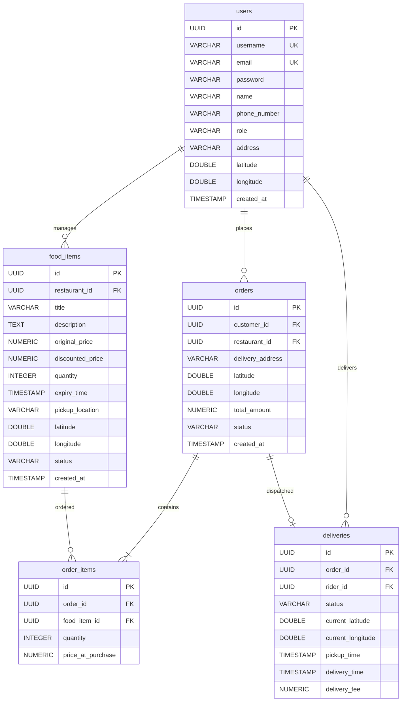

# AnnDaan - Leftover Food Delivery Backend

**AnnDaan** (meaning *giving food* or *food donation/sharing*) is a backend REST application designed to curb food waste. It enables restaurants, caterers, and event managers to sell their leftover excess food at heavily discounted prices, allows price-conscious customers to purchase it, and coordinates local riders to pick up and deliver the meals.

---

## 🚀 Key Features

- **Role-Based Workflows**: Separate, secure access control bounds for `RESTAURANT`, `CUSTOMER`, and `RIDER` users using Spring Security & stateless JWT tokens.
- **Leftover Food Listings**: Restaurants can list leftovers specifying the title, original price, discounted (cheap) price, quantity, expiry time, and pickup coordinates.
- **Transactional Checkout**: Customers check out available active leftovers. Real-time stock reservation prevents double-booking and overselling.
- **Rider Dispatch Management**: Riders view pending paid jobs, claim delivery assignments, update their GPS coordinates, and progress delivery statuses (`ASSIGNED` ➔ `PICKED_UP` ➔ `DELIVERED`).
- **Fully Containerized Environment**: Run the entire system (Application + PostgreSQL Database) in a single command using Docker and Docker Compose.
- **HTTP Client Test Suite**: Integration test suite inside `request.http` covering the complete lifecycle from signups to tracking and security checks.

---

## 🛠 Tech Stack

- **Framework**: Spring Boot 3.3.1 (Spring Web, Spring Security, Spring Data JPA, Spring Validation)
- **Language**: Java 21 (Lombok removed to ensure full host JDK compatibility)
- **Database**: PostgreSQL 16
- **Containerization**: Docker & Docker Compose v2
- **Authentication**: Stateless JSON Web Tokens (JJWT 0.12.5)

---

## 📁 Project Directory Structure

```
AnnDaan/
├── pom.xml                     # Maven build and dependencies
├── Dockerfile                  # Multi-stage container build file
├── docker-compose.yml          # DB and Backend orchestration
├── start.sh                    # Single-command start script (executable)
├── stop.sh                     # Single-command stop script (executable)
├── request.http                # HTTP Client test/unit cases
├── README.md                   # Setup and usage guide
└── src/
    └── main/
        ├── java/com/anndaan/app/
        │   ├── AnnDaanApplication.java     # Boot entrypoint
        │   ├── config/                     # Security and JWT filters
        │   ├── controller/                 # REST Controller endpoints
        │   ├── dto/                        # Request/Response DTO records
        │   ├── entity/                     # JPA Hibernate entities
        │   ├── repository/                 # Database repositories
        │   └── service/                    # Business services
        └── resources/
            └── application.yml             # Spring properties
```

---

## 🏗 System Design & ER Diagram



---

## ⚡ Setup & Execution (Single Commands)

Make sure **Docker Desktop** is running on your Mac before executing.

### 1. Start Everything

To build the project and launch the Postgres database and Spring Boot server, run:

```bash
./start.sh
```

This script:
- Verifies that your Docker daemon is active.
- Automatically compiles the Spring Boot project inside a build container.
- Starts PostgreSQL, runs database health checks, and starts the Backend once the DB is ready.
- Exposes the backend API at `http://localhost:8088` and PostgreSQL database on port `5432`.

### 2. Monitor Container Logs

To view real-time logs from the Spring Boot application:

```bash
docker compose logs -f backend
```

To view Postgres logs:

```bash
docker compose logs -f db
```

### 3. Stop Everything

To stop the containers and wipe the database volumes (starting fresh next time), run:

```bash
./stop.sh
```

---

## 🧪 API Integration & Testing Guide (`request.http`)

The [request.http](file:///Users/deepawasthi/Developer/AnnDaan/request.http) file acts as the unit/integration test suite. Open it in VS Code (with the *REST Client* extension) or IntelliJ IDEA.

The file is organized into sequential steps:

1. **Signups**: Registers three accounts:
   - `tasty_bites` (Restaurant)
   - `cheap_eater` (Customer)
   - `speedy_rider` (Rider)
2. **Logins**: Logs in the users. The IDE extracts the returned JWT tokens into local variables (`@restaurantToken`, `@customerToken`, `@riderToken`) to secure subsequent requests.
3. **Restaurant Posting**: The restaurant lists cheap leftover food items (Veg Thalis and Bakery Cupcakes) with set expiration dates.
4. **Customer Purchase**: The customer lists all available leftovers, adds items to their shopping cart, creates an order, and pays for the order.
5. **Rider Delivery**: The rider lists available paid orders, claims the delivery, posts coordinates, marks the order as picked up from the restaurant, and marks it as delivered at the customer's address.
6. **Verification**: Checks final order histories and delivery logs.
7. **Security Checks (Negative Tests)**: Confirms that unauthorized role calls (e.g. a customer trying to post food or view rider assignments) return `HTTP 403 Forbidden` responses.
